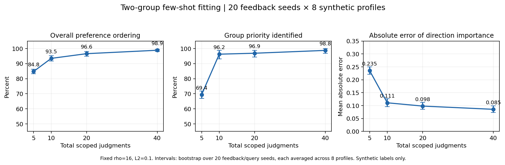
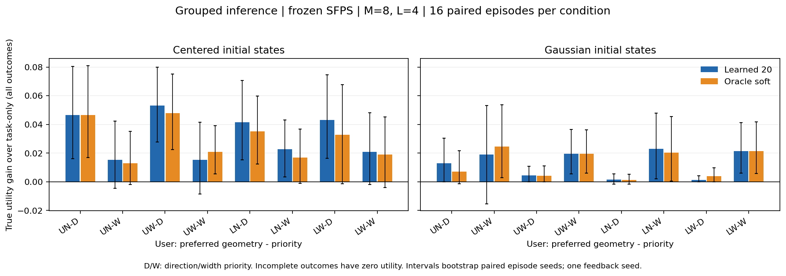
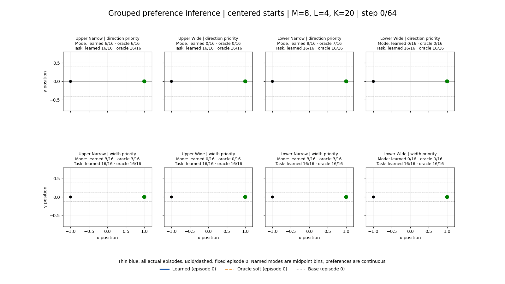
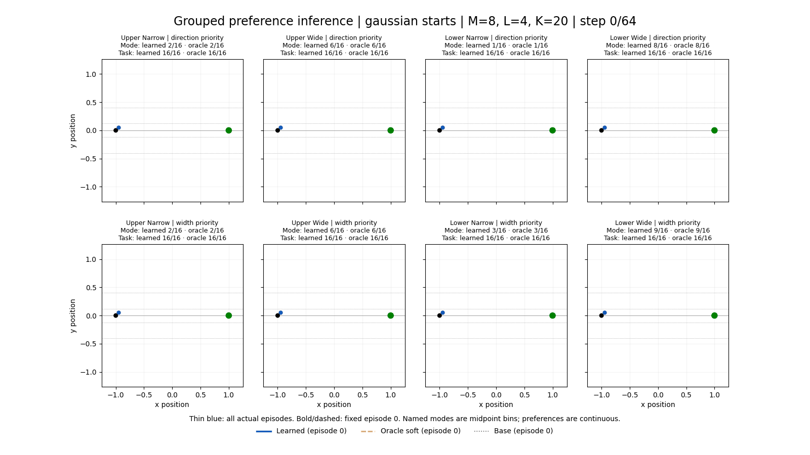

# Two-group preference steering: 구현 및 실험 기록

상태: 두 그룹 toy 구현, 독립 코드 리뷰, 전체 테스트, 실제 checkpoint의 추론 실험과 저장 기록 재검산 완료. VRHandover 전체 적용을 검증했다는 뜻은 아니다.

사용자 승인 범위는 `upper/lower`, `wide/narrow` 두 그룹이다. P/M/C는 toy에 추가하지 않는다. 기존 B2 optimized SFPS policy를 동결하고, 사용자별 작은 utility model만 fit한다. 실제 사람의 few-shot 학습 성능과 policy 자체의 in-context learning을 입증하는 실험은 아니다.

## 수식과 학습 데이터

실행된 초기 위치를 제외한 64개 위치에 대해 다음 bounded features를 사용한다.

\[
r_t=\tanh(y_t/0.35),\quad d=\frac1{64}\sum_{t=1}^{64}r_t,
\quad e=\frac1{64}\sum_{t=1}^{64}r_t^2,
\]
\[
f_D=\left[\frac{1+d}{2},\frac{1-d}{2}\right],\qquad
f_W=[e,1-e],\qquad
U_\theta(\tau)=\alpha_Dw_D^Tf_D(\tau)+\alpha_Ww_W^Tf_W(\tau).
\]

`w_D`, `w_W`, `alpha`는 각각 합이 1인 비음수 두 원소 벡터다. 그룹 내부 선호 두 개와 그룹 중요도 한 개, 총 세 자유도를 학습한다. 방향/폭 feature는 연속적인 desirability다. 예를 들어 narrow 선호는 중앙 직선 경로도 선호할 수 있으므로, `upper_narrow`라는 사용자 이름이 해당 midpoint mode를 정확히 지정하는 제약은 아니다.

각 비교에는 scope가 있다. `Delta f=f(A)-f(B)`일 때:

\[
P(A\succ_D B)=\sigma(\rho w_D^T\Delta f_D),\qquad
P(A\succ_W B)=\sigma(\rho w_W^T\Delta f_W),
\]
\[
P(A\succ_O B)=\sigma\!\left(\rho\sum_r\alpha_rw_r^T\Delta f_r\right).
\]

**그룹 내부 질문에는 alpha가 들어가지 않는다.** 전체 비교만 사용하면 complementary features 때문에 세 자유도 중 두 조합만 관측된다. 전체 비교에 붙였던 이전 flat pilot label을 그룹 label로 재해석하지 않는다. 새 독립 analytic query와 해당 scope에 대한 synthetic label을 생성한다.

응답 20개는 방향 6개, 폭 6개, 전체 8개다. 5/10/20/40개는 같은 응답열의 prefix다. 그룹별 평균 logistic loss의 합과 uniform prior 주위 L2 정규화를 사용한다. 그룹별 fit 후 alpha를 fit한 초기값과 uniform 초기값 등에서 joint bounded optimization을 수행한다. Joint objective는 비볼록이므로 수치적 수렴을 전역 최적성으로 해석하지 않는다.

합성 사용자는 네 선호 조합 × 두 중요도 설정으로 총 8명이다. 원하는 그룹 내부 성분의 weight는 .9, 반대 성분은 .1이다. 방향 우선 사용자는 `alpha=(.8,.2)`, 폭 우선 사용자는 `alpha=(.2,.8)`이다. Feedback scale `rho=16`, inference scale `beta=16`은 이번 bounded feature 단위에서 고정한 pilot 설정이며 최적값이나 논문의 공인 hyperparameter가 아니다. 이전 standardized feature의 `beta=1`과 같은 강도가 아니다.

### Feature 자체의 mode 한계: policy와 무관한 확인

Analytic path의 signed amplitude를 -0.58..0.58, 간격 .001로 훑어 oracle utility를 비교했다. 방향 우선 `upper_narrow` 사용자의 최댓값은 +.58(wide), 폭 우선 사용자의 최댓값은 약 +.029(other)였다. Lower 쪽도 부호만 반대다. 따라서 이 feature 정의와 alpha 아래에서 oracle까지 원하는 네 mode 모두를 고른다는 기대는 성립하지 않는다. 방향 feature도 높이의 영향을 받고, narrow feature는 0 excursion을 선호하기 때문이다. 이것은 inference 실패와 구분해야 한다. `analytic_optima.json`에 이 독립 확인을 저장했다.

## 현재 후보를 고정한 continuation 평가

현재 replan에서 `M=8`개의 latent를 뽑는다. 각 latent의 현재 8-step chunk를 한 번 계산하고, 이를 공통 prefix로 고정한 다음 `L=4`개의 독립적인 base-policy continuation으로 분기한다.

\[
\widehat Q_\theta(z_j)=\frac1L\sum_{\ell=1}^{L}
 U_\theta(\tau_{\rm past}\oplus\tau_{\rm current}(z_j)\oplus
 \tau_{\rm future}^{j,\ell}),
\]
\[
\widehat C(z_j)=\frac1L\sum_{\ell=1}^L
 \left[(\mathrm{goalError}_{j\ell}/0.1)^2+25\,\mathbf1\{\mathrm{taskFailure}_{j\ell}\}\right],
\]
\[
P(j)\propto\mathbf1\{\mathrm{currentValid}_j\}
\exp\{\beta\widehat Q_\theta(z_j)-\widehat C(z_j)\}.
\]

평균 feature/utility를 구한 **다음** 지수를 취한다. `mean(exp(beta*U))`는 다른 target이다. 유한 L의 Q 추정 오차는 지수화 뒤 편향을 남기므로 이것을 정확한 Gibbs sampling으로 주장하지 않는다. M만 늘려도 이 편향이 사라지지는 않는다. 별도 task cost가 있으므로 beta=0은 task-conditioned 선택이며 raw base와 다르다.

현재 chunk가 실패하는 후보는 제외한다. 이후 continuation에서 실패하는 경우에는 해당 샘플을 버리지 않는다. 중도 거부된 경로의 네 desirability를 0으로 두고 task failure cost를 평균에 포함한다. 끝까지 생성했지만 목표를 놓친 경로는 geometric features를 유지하고 task cost를 받는다. 모든 현재 후보가 invalid인 guided decision은 hold-position chunk로 처리하고 fallback을 기록한다. 실제 환경에는 선택한 현재 8개 command만 실행한다.

## Anchor: 원본 SFPS와의 대응

원본 SFPS는 joint ODE의 초기값을 `a0=nobs[-1,:2]`, `z0~N(0,I)`로 둔다. `num_actions`에는 anchor가 포함되며 local maximum time은 `(num_actions-1)/(pred_horizon-1)`이다. 원본 rollout도 9개 예측점 중 index 1..8을 실행한다. [원본 SFPS](https://github.com/siddancha/streaming-flow-policy/blob/main/streaming_flow_policy/pusht/sfps.py), [원본 실행 코드](https://github.com/siddancha/streaming-flow-policy/blob/main/streaming_flow_policy/pusht/dp_state_notebook/rollout.py).

따라서 현재 체크포인트의 16-point 학습 규약에서는 다음과 같다.

```text
실제 관측 prefix 끝: 현재 위치 p_q (anchor의 근거)
ODE 반환:           [anchor, a_(q+1), ..., a_(q+8)]
local time:         [0, 1/15, ..., 8/15]
실제 실행:                  a_(q+1), ..., a_(q+8)
다음 replan:        실제로 도달한 p_(q+8)를 다시 관측
```

여기서 anchor는 선호 예시나 사용자별 reference trajectory가 아니다. 모든 현재 latent 후보가 공유하는 ODE의 시작 action 좌표다. Toy는 position command를 즉시 추종하므로 실제 최신 관측은 마지막 accepted command와 일치한다. 후보별로 시작 anchor를 바꾸지 않는다.

다만 정규화까지 고려하면 주의할 차이가 있다. 원본은 normalized observation의 위치를 action 초기좌표에 사용한다. 현재 저장된 obs/action x 최소값은 각각 `-1`, `-0.9999254942`이므로, action 통계로 역정규화한 **버려지는 모델 anchor**에는 최대 약 `7.45e-5`의 물리 좌표 차이가 있다. 동결한 체크포인트의 원본 규약을 유지하며, 실제 관측 anchor와 모델이 반환한 anchor를 구분해 기록한다. 이 차이를 실제 행동 1개로 실행하지 않는다. 실제 optimized checkpoint에 서로 다른 latent 8개를 넣은 확인에서도 normalized anchor 오차는 정확히 0, 물리 좌표 차이는 `7.4505805969e-5`였다. 원자료는 `env/artifacts/grouped_preference/analysis/anchor_check.json`이다.

Guided Streaming Policy의 stochastic-interpolant 실행 코드는 chunk 간 action을 carry하는 별도 시간 규약을 사용한다. 이 SI 코드를 그대로 SFPS auxiliary-latent checkpoint에 이식하지 않았다. [대조한 SI 실행 코드](https://github.com/0scarJ1ang/guided-streaming-policy/blob/main/Push-T/inference/static/inference_steg.py).

## 검증과 실험 결과

### Few-shot fitting: 독립 응답 반복

동일한 8개 합성 사용자 profile에 대해 query/응답 seed를 20개 사용했다. Budget당 160 fit, 전체 640 fit이다. 별도 고정 analytic held-out 512쌍에서 oracle의 noiseless 전체 선호 순서와 비교했다. `중요도 판별`은 alpha_D가 .5보다 큰지의 판별이며, alpha 값 자체를 정확히 복원했다는 뜻은 아니다.

| 총 응답 K | 그룹 중요도 판별 | 전체 선호 순서 일치 | alpha_D 평균 절대오차 | 그룹 내부 선호 방향 모두 일치 |
|---|---:|---:|---:|---:|
| 5 | 69.4% | 84.8% | 0.235 | 95.6% |
| 10 | 96.2% | 93.5% | 0.111 | 100.0% |
| 20 | 96.9% | 96.6% | 0.098 | 100.0% |
| 40 | 98.8% | 98.9% | 0.085 | 100.0% |

수치 범위 처리와 안정적인 평균 계산을 보완한 최종 코드로 반복 평가를 다시 실행했으며, 640개 모두 설정한 projected-gradient 및 optimizer 수렴 기준을 충족했다. 보완 전 1건의 미수렴이 있었고, 최종 결과에서는 누락 없이 모든 fit을 다시 계산했다. 숫자는 synthetic BT 응답 모델과 고정된 두 feature에 대한 결과다. 실제 사용자의 선호 표현이나 새로운 경로 분포로의 일반화를 검증하지 않는다.



그래프의 구간은 사용자 8명의 결과를 seed별로 평균한 다음 20개 seed를 bootstrap한 95% 구간이다. 같은 seed의 사용자/예산 결과를 독립 표본처럼 늘려 세지 않는다. 원자료: `env/artifacts/grouped_preference/analysis/fit_replicates.json`, 재현 스크립트: 같은 폴더의 `fit_replicates.py`.

### Conditional continuation의 Monte Carlo 진단

실제 optimized checkpoint에서 초기 context 3개 × 현재 latent 8개를 고정하고, 후보마다 64개 미래를 생성했다. 같은 64개 샘플 bank를 L=1/4/16 크기의 묶음으로 나눠 평균을 비교했다. 아래는 upper+narrow 선호를 유지하면서 alpha를 바꾼 두 profile의 Q 추정 RMSE다.

| 중요도 | 초기 context | 후보 간 Q64 표준편차 | L1 RMSE | L4 RMSE | L16 RMSE |
|---|---|---:|---:|---:|---:|
| direction | centered | 0.0473 | 0.0044 | 0.0021 | 0.0009 |
| direction | gaussian_0 | 0.0215 | 0.0027 | 0.0013 | 0.0006 |
| direction | gaussian_1 | 0.0140 | 0.0038 | 0.0020 | 0.0011 |
| width | centered | 0.0320 | 0.0033 | 0.0016 | 0.0008 |
| width | gaussian_0 | 0.0333 | 0.0049 | 0.0025 | 0.0012 |
| width | gaussian_1 | 0.0244 | 0.0067 | 0.0035 | 0.0019 |

L4는 이 고정된 초기 context들에서 L1보다 RMSE를 대략 절반으로 줄였다. Q64도 유한 샘플 평균이며 동일 bank와 상관된 참조다. 따라서 이것은 true Q에 대한 unbiased 오차 측정, 전체 closed-loop 상황의 충분성 보장, 또는 L4의 제어 성능 우월성 검증이 아니다. 원자료와 실행 스크립트는 `env/artifacts/grouped_preference/analysis/continuation_uncertainty.{npz,json,py}`다.

### Closed-loop pilot


Seed 0의 feedback 한 세트로 8개 사용자 profile을 fit하고, 각 조건에서 같은 16개 환경/latent seed를 재사용했다. Centered/Gaussian 각 18개 조건, 총 **36조건 × 16 = 576 실제 Gym episode**다. 이 576개를 독립 성공률 표본으로 합산하지 않는다. 실행은 RTX A5000 GPU 1, Torch thread 1에서 약 **422.7초** 걸렸다.

- Centered: raw base, task-only, oracle-soft, learned-20의 모든 조건이 각각 16/16 성공.
- Gaussian: raw base 14/16, 모든 guided 조건 각각 16/16 성공. Base의 두 실패는 완주 후 goal tolerance 미충족이며, 수치/행동 한계 오류는 아니었다.
- Guided fallback은 이번 pilot에서 0회다. All-invalid hold fallback 자체는 별도 실제 Gym 테스트로 확인했다.
- 32개 budget별 fit 모두 수렴했다. K20의 alpha 우선순위는 8명 모두 맞았지만, 예를 들어 upper-wide/width-priority 사용자의 alpha_D 추정은 0이었다(정답 .2). 정확한 중요도 복원으로 해석하지 않는다.

아래 mode 수치는 각 사용자 이름에 대응하는 **midpoint bin**에 들어간 횟수다. L/O는 learned-20/oracle-soft이며 각 분모는 16이다. Oracle도 동일한 확률적 선택을 하므로, 유한 표본의 oracle utility가 성능 상한은 아니다.

| 사용자 | true alpha_D | learned alpha_D | Centered mode L/O | Gaussian mode L/O | Centered utility gain | Gaussian utility gain |
|---|---:|---:|---:|---:|---:|---:|
| upper_narrow_direction | 0.8 | 0.756 | 6/6 | 2/2 | +0.0465 | +0.0130 |
| upper_narrow_width | 0.2 | 0.110 | 3/3 | 2/2 | +0.0154 | +0.0190 |
| upper_wide_direction | 0.8 | 0.767 | 0/0 | 6/6 | +0.0533 | +0.0044 |
| upper_wide_width | 0.2 | 0.000 | 0/0 | 6/6 | +0.0153 | +0.0196 |
| lower_narrow_direction | 0.8 | 0.810 | 8/7 | 1/1 | +0.0415 | +0.0016 |
| lower_narrow_width | 0.2 | 0.273 | 3/3 | 3/3 | +0.0226 | +0.0231 |
| lower_wide_direction | 0.8 | 0.715 | 0/0 | 8/8 | +0.0432 | +0.0014 |
| lower_wide_width | 0.2 | 0.110 | 0/0 | 9/9 | +0.0210 | +0.0214 |

Utility gain은 해당 true user utility의 learned-20 평균에서 task-only 평균을 뺀 값이며, 실패를 포함한 모든 16 episode가 분모다. 이번 task-only/learned/oracle은 모두 성공해 성공 subset도 동일하다. **16개 조합 모두 점추정 gain은 양수**지만, paired seed bootstrap 95% 구간은 8개 조합에서 0을 포함한다. 한 feedback seed와 16개 episode의 탐색적 pilot으로 일반적인 우월성을 결론내리지 않는다.



학습된 selector의 평균 ESS는 약 7.36–7.86 / 8이었다. 후보 재가중은 대부분의 replan에서 강하지 않다. Guided 조건의 전체 16-episode batch replan p50은 약 1.43–1.46초이며, 이는 후보와 미래 simulation, 실제 Gym 실행을 포함한 batch 측정이다. 단일 로봇 latency나 실시간 제어 검증 수치가 아니다.

**Mode 제어는 해결되지 않았다.** Centered에서는 실제 생성된 최대 |y|가 약 .310으로, 모든 learned/oracle 조건에서 wide bin 진입이 0/16이었다. Gaussian에서는 초기 상태가 정한 위/아래 경로가 강하게 유지된다. GIF의 고정 episode 0도 모든 사용자 조건에서 upper-wide로 남는다. 따라서 남은 문제를 few-shot fitting 오차만으로 설명할 수 없다. Proposal coverage와 현재 continuous feature의 mode 의미를 함께 바꿔 검토해야 한다.

### 실제 추론 GIF

윗줄은 방향 우선, 아랫줄은 폭 우선이며 각 열은 upper-narrow / upper-wide / lower-narrow / lower-wide다. 얇은 파란 선은 전체 16개 실제 episode다. 굵은 파랑은 learned-20, 주황 점선은 oracle-soft, 회색 점선은 raw base의 **고정 episode 0**이다. 예쁜 예시만 골라 표시하지 않는다. 그림에는 각 방법의 mode 수와 task 성공 수를 함께 적었다. Gaussian의 큰 excursion이 잘리지 않도록 축 범위를 실제 저장 경로에 맞췄다.





독립 audit은 **576개 episode를 새 Gym에서 재실행**하여 accepted state와 종료 flag가 모두 같은지 확인했다. **4,608개 decision**의 실제 prefix, 후보별 공통 현재 chunk, 평균 feature, goal cost, score, 저장 seed에 따른 categorical 선택도 모두 일치했다. `independent_audit.json`과 `animations/mode_summary.json`에 재계산 결과가 있다. 실행 전후 checkpoint, loaded policy parameter, stats 파일과 배열이 모두 그대로임을 확인했다.


## 재현과 검증 기록

B2 worktree 루트에서 실행한다. 출력 폴더가 이미 있으면 새 이름을 사용한다.

```bash
MPLCONFIGDIR=/tmp/grouped-mpl .venv/bin/python -m env.run_grouped_preference \
  --checkpoint env/artifacts/stage_b/b2-seed0-optimized/sfps_best.pt \
  --stats env/artifacts/stage_b/b2-seed0-optimized/pusht_stats.npz \
  --demonstrations ../../env/artifacts/demonstrations.npz \
  --output-dir env/artifacts/grouped_preference/pilot-seed0 \
  --device cuda:1 --seed 0 --candidates 8 --continuations 4 \
  --rollout-count 16 --integration-steps-per-action 6 --torch-threads 1
```

전체 `env/tests` 검증: **366 passed, 2 skipped, 14 warnings**, 92.96초. Skip은 sandbox에서 CUDA 사용 불가와 기존 canonical B1 fixture 부재다. 경고는 기존 NumPy/Gym `np.bool8` deprecation과 sandbox의 NVML 초기화 경고이며, 별도로 GPU 1에서 실제 checkpoint 추론을 실행했다. 그룹 fitting, conditional branching, 실제 Gym fallback, 두 번의 tiny-checkpoint 전체 실행과 기존 flat pilot 회귀가 포함된다. 단위 테스트의 정상 flow 경로에서는 후보마다 현재 chunk를 한 번 계산하며, 수치 예외 시 기존 executor의 개별 row 재시도는 허용한다.

별도 검증 도구는 `env/artifacts/grouped_preference/analysis/`에 있다.

- `fit_replicates.py`: query/feedback seed 20개로 fitting 반복.
- `continuation_uncertainty.py`: 같은 현재 후보에서 L64 미래 sample bank 평가.
- `audit_saved_inference.py`: 실제 command 전체를 새 Gym에서 재실행하고, 공통 prefix·평균 feature·task cost·score·seed에 따른 선택을 검산.
- `render_inference.py`, `plot_rollouts.py`: 저장된 실제 경로와 utility 차이 시각화.

Checkpoint SHA-256: `4228d9dae9baedc8b64d66ffb4d768798731f2c6788efea681dc18d745e2abba`.
Train-data digest: `3fb4d5e8f79027bf1c113c8a85d48b82e30e43e707b8c895be96b9ab49d82e78`.

작업은 기존 `codex/stage-b2-sfps` worktree에 보존한다. 기존 미커밋 변경을 포함한 공유 작업 상태를 지키기 위해 commit·merge 없이 새 파일 및 변경 diff로 리뷰했다. Commit 기록이 없으므로 작업 ledger와 수동으로 생성한 task brief도 보존한다. 추후 통합 시 commit 또는 기록 형식 정리가 필요할 수 있다. Anchor는 원본 normalized-observation 규약을 유지하는 결정을 했으며, 물리 좌표가 정확히 같은 별도 anchor 초기화가 필요하면 그 policy variant를 따로 평가해야 한다.
