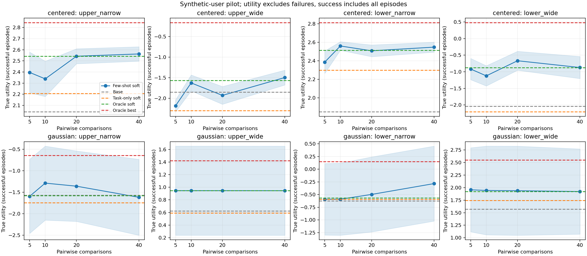
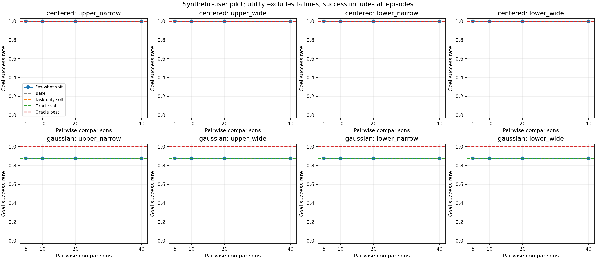
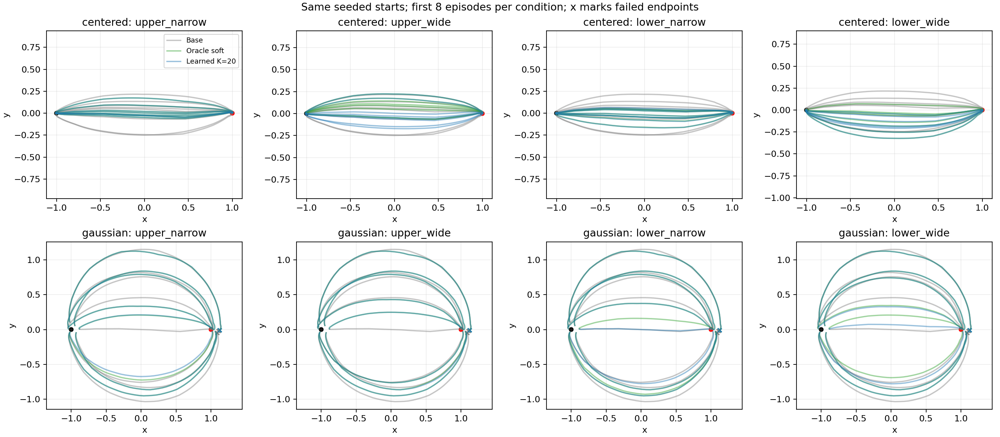

# Frozen SFPS few-shot preference steering: seed-0 pilot

실행·확인일: 2026-09-11. 기존 `codex/stage-b2-sfps` worktree의 B2 optimized
checkpoint를 사용했다. **Policy를 동결하고, 전체 경로 비교 5/10/20/40개로
두 preference weight만 추정한 뒤 inference 때 후보를 선택하는 경로를 구현·실행했다.**
이는 합성 사용자 한 label dataset씩으로 수행한 pilot이며, 실제 사람의 few-shot
적응 성능이나 일반적인 mode 제어가 검증되었다는 결과는 아니다.

## 방법과 이번 구현 범위

전체 경로 `tau`에서 기존 feature를 그대로 사용한다.

```text
rho_t = tanh(y_t / 0.35)
phi(tau) = sum(t=1..64) (([rho_t, rho_t^2] - train_mu) / train_scale) / 64
U_w(tau) = w^T phi(tau)
P(A preferred to B | w) = sigmoid(w^T [phi(A) - phi(B)])
loss(w) = sum_i softplus(-label_i * w^T delta_phi_i) + 0.1/2 * ||w||^2
```

`train_mu`와 `train_scale`은 기존 demonstration bank의 train split에만 fit한다.
방향, 폭, 방향과 폭의 tradeoff를 바꾸는 독립적인 analytic 전체 경로 쌍을 만든다.
Query 생성은 사용자 정답 weight를 참조하지 않는다. 사용자별 noisy BT label 40개의
앞 5/10/20/40개를 사용하므로 budget 간 데이터가 nested다. 별도 seed로 만든
analytic held-out 256쌍과 실제 centered policy 경로에서 만든 held-out 256쌍도 평가한다.

학습 대상은 `w` 두 개다. 현재 zero prior는 L2 정규화이며, 다른 사용자로부터 학습한
meta-prior는 아니다. 따라서 이번의 few-shot adaptation은 작은 utility model의
test-time fitting이고, policy의 in-context learning이나 weight update가 아니다.

매 8개 행동마다 남은 전체 episode의 latent schedule 32개를 제안한다. 각 후보는
기존 SFPS의 두 관측 history, 9개 예측점 중 anchor 제외, 8개 행동 후 history 갱신과
다음 latent 재추출을 따른다. 이미 실행한 prefix와 미래 후보를 합친 전체 경로에
아래 score를 계산하고, 선택한 후보의 첫 8개 raw command만 실제 Gym에 실행한다.

```text
score_j = U_w(realized_prefix + candidate_future_j) - (final_goal_error_j / 0.1)^2
P(select j) proportional to exp(score_j)  # beta = 1
```

수치 오류·행동 한계 위반 후보는 선택 확률 0으로 처리한다. 전부 invalid이면 후보 0을
명시적 fallback으로 기록하며 Gym의 실제 거부 동작을 유지한다. Goal tolerance는
soft cost이므로 task 성공을 보장하지 않는다. 전체 경로의 label을 개별 chunk label로
복제하지 않는다. 전체 prefix 보존은 향후 비가산 feature로 확장할 때도 필요하다.

비교 방법은 다음과 같다.

| 방법 | Preference weight | 후보 선택 |
|---|---|---|
| Base | 사용하지 않음 | 후보 1개, index 0 |
| Task-only soft | 0 | 32개 중 goal cost 기반 확률 선택 |
| Oracle soft | 합성 사용자 정답 | 32개 중 확률 선택 |
| Oracle best | 합성 사용자 정답 | 32개 중 최고 score 선택 |
| Learned K | K개 비교로 추정 | 32개 중 확률 선택 |

Oracle best는 finite-candidate 비교군이며 전역 최적해나 성능 상한은 아니다.
현재 SFPS는 joint latent ODE이므로 noisy action-chunk diffusion/SDE의 gradient
guidance 공식을 그대로 적용하지 않았다. 이번 결과는 finite-candidate resampling이며
정확한 tilted path distribution sampling은 아니다. Gradient steering, active-query
최적화, 실제 사용자 UI, merge–rebranch의 `F1*F2` 관계 feature는 이번 pilot 범위에 없다.

## 실행 설정과 재현

- Seed 0, synthetic user 4명: `upper_narrow=(2,-1)`, `upper_wide=(2,1)`,
  `lower_narrow=(-2,-1)`, `lower_wide=(-2,1)`.
- Centered/Gaussian 각각 방법당 16 episode. 각 조건에서 같은 reset seed와
  replan별 proposal randomness를 사용한다. 경로가 달라진 후의 상태까지 같다는 뜻은 아니다.
- 시작 상태별 coverage: centered 1개, 고정 Gaussian 2개에 각각 512 continuation.
- 52개 조건 × 16 = 832 closed-loop episode, 별도 coverage 1,536개.
  공통 seed를 재사용하므로 832개를 독립적인 성공률 표본으로 합산하지 않는다.
- RTX A5000 GPU 1, Torch CPU thread 1, action당 ODE integration step 6.
  기록된 실행 시간은 약 618.7초다.

Worktree 루트에서 실행한 명령:

```bash
.venv/bin/python -m env.run_preference \
  --checkpoint env/artifacts/stage_b/b2-seed0-optimized/sfps_best.pt \
  --stats env/artifacts/stage_b/b2-seed0-optimized/pusht_stats.npz \
  --demonstrations ../../env/artifacts/demonstrations.npz \
  --output-dir env/artifacts/preference/pilot-seed0 \
  --device cuda:1 --seed 0 --candidates 32 --coverage-count 512 \
  --rollout-count 16 --integration-steps-per-action 6 --torch-threads 1
```

재실행할 때 새 output directory를 지정해야 한다. 기존 결과가 있으면 덮어쓰지 않고
거부한다. Checkpoint SHA-256은
`4228d9dae9baedc8b64d66ffb4d768798731f2c6788efea681dc18d745e2abba`,
train-data digest는
`3fb4d5e8f79027bf1c113c8a85d48b82e30e43e707b8c895be96b9ab49d82e78`이다.
실행 전후 checkpoint와 loaded policy state의 불변을 확인했다.

## 관측한 결과

### 같은 시작 상태에서의 생성 범위

모든 coverage 경로가 task에 성공했다. 아래 분류는 기존 midpoint 기준으로,
`other`는 생성 실패가 아니라 네 named mode의 판정 범위 밖이라는 뜻이다.

| 고정 시작 상태 | Upper narrow | Upper wide | Lower narrow | Lower wide | Other |
|---|---:|---:|---:|---:|---:|
| Centered `(-1, 0)` | 58 | 0 | 86 | 0 | 368 |
| Gaussian 0 `(-0.983872, 0.009982)` | 446 | 7 | 0 | 0 | 59 |
| Gaussian 1 `(-1.009466, -0.031566)` | 0 | 0 | 0 | 512 | 0 |

이 표본에서는 작은 시작 상태 차이에 따라 mode 분포가 크게 달랐다. Centered 512개에서
wide가 관측되지 않았으므로 이 상태의 wide preference는 선택만으로 충족하기 어렵다.
이는 모든 latent에서 wide 생성이 불가능하다는 증명은 아니다. 앞으로는 unconditional
coverage와 별개로 **같은 상태에서의 conditional coverage**를 우선 확인해야 한다.

### 비교 20개에서의 utility

아래 값은 사용자 정답 weight로 계산한 **task 성공 경로의 평균 utility**다.
높을수록 좋으며, train feature 표준화 때문에 음수도 정상이다. 사용자 간 수치 크기를
만족도의 절대 척도로 비교하지 않는다.

| 시작 조건 | 사용자 | Base | Task-only | Learned 20 | Oracle soft | Oracle best |
|---|---|---:|---:|---:|---:|---:|
| Centered | Upper narrow | 2.0422 | 2.2067 | **2.5415** | 2.5415 | 2.8439 |
| Centered | Upper wide | -1.8484 | -2.2970 | **-1.9276** | -1.5634 | -0.1576 |
| Centered | Lower narrow | 1.8484 | 2.2970 | **2.5070** | 2.5135 | 2.8117 |
| Centered | Lower wide | -2.0422 | -2.2067 | **-0.6680** | -0.8797 | 0.4824 |
| Gaussian | Upper narrow | -1.5695 | -1.7463 | **-1.3598** | -1.5817 | -0.6468 |
| Gaussian | Upper wide | 0.6242 | 0.5919 | **0.9458** | 0.9452 | 1.4201 |
| Gaussian | Lower narrow | -0.6242 | -0.5919 | **-0.4974** | -0.5643 | 0.1489 |
| Gaussian | Lower wide | 1.5695 | 1.7463 | **1.9385** | 1.9220 | 2.5490 |

Learned 20은 이 seed의 모든 8개 사용자·시작 조건에서 task-only보다 높았다.
그러나 centered upper-wide는 base보다 낮다. Oracle soft를 일부 능가하는 것은
유한 표본의 확률적 선택과 weight 추정 차이가 섞인 결과이며, oracle보다 좋은 preference를
학습했다는 의미가 아니다. Gaussian에서는 base와 soft 모두 성공이 14/16이지만
성공한 episode 집합이 다르다(0-based index 4, 14의 성공 여부가 바뀜). 따라서
base와 soft의 성공 조건부 utility는 동일한 시작 상태 부분집합의 평균이 아니다.
Task-only와 learned/oracle soft끼리는 성공한 episode 집합이 동일하다. Oracle best는
16개 모두 성공하므로 비교 집합이 다시 달라진다. 전체 64 step을 완료한 경로의 평균
utility도 diagnostics에 별도로 저장했다.



음영은 성공 episode 간 표준오차 ±1 SE다. 사용자별 label dataset은 하나뿐이므로
feedback dataset이나 사람 간 불확실성을 나타내지 않는다. K가 늘어도 성능이 단조 증가하지
않으며, Gaussian 조건의 큰 episode 편차를 고려하면 이 pilot로 통계적 우월성을 주장할 수 없다.

### Task 성공과 실패 처리

| 시작 조건 | 방법 | 성공 | 성공률 | Wilson 95% interval |
|---|---|---:|---:|---:|
| Centered | 모든 방법·사용자·K, 각 조건별 | 16/16 | 100% | 80.64–100% |
| Gaussian | Base 및 모든 soft 조건, 각 조건별 | 14/16 | 87.5% | 63.98–96.50% |
| Gaussian | Oracle best, 각 사용자별 | 16/16 | 100% | 80.64–100% |

모든 832 episode가 64개 행동을 완료했다. Numerical failure, action-limit failure,
all-invalid fallback은 각각 0이었다. Gaussian의 미성공 episode는 최종 goal tolerance를
충족하지 못한 경우다. Soft preference 선택의 utility 변화와 task 성공 변화는 분리해서
해석해야 한다. 현재 learned soft의 task 성공률은 base와 같았다.



### Preference 추정과 계산 비용

총 16개 fit은 모두 feature rank 2이고 수렴했다. K=20 결과:

| 사용자 | 추정 weight | Analytic held-out accuracy / log-loss | Policy-generated held-out accuracy / log-loss | Generated noiseless ordering accuracy |
|---|---|---|---|---:|
| Upper narrow | `(1.875, -0.607)` | 92.19% / 0.2618 | 67.97% / 0.5857 | 96.09% |
| Upper wide | `(1.295, 0.749)` | 92.97% / 0.2510 | 67.19% / 0.6314 | 94.92% |
| Lower narrow | `(-2.781, -0.853)` | 91.80% / 0.2139 | 66.02% / 0.6427 | 96.48% |
| Lower wide | `(-3.574, 0.542)` | 83.98% / 0.3680 | 67.97% / 0.6151 | 95.70% |

Accuracy는 noisy BT label에 대한 값이며 마지막 열은 정답 utility의 부호 순서에 대한
값이다. 같은 centered policy에서 생성한 경로들은 비교 차이가 작을 수 있으므로
analytic query 성능만으로 배포 경로의 preference 예측을 평가하지 않는다.
5개만으로도 이번 dataset에서는 weight 부호가 맞았지만 보편적인 5-shot 식별 보장은 없다.

Soft 조건의 평균 ESS는 조건별 28.85–32.00/32였다. 이 설정의 확률 선택은 비교적
약하게 집중된다. Replan batch latency의 조건별 p50은 soft 1.43–1.89초,
p95는 2.43–2.61초였다. 이는 16개 episode cohort 전체의 남은 경로 후보를 계산한
오프라인 측정이며, **한 로봇에서의 실시간 steering latency로 해석하면 안 된다.**
Base도 동일한 남은 경로 시뮬레이터를 쓰되 후보는 1개이므로, 기존 SFPS 한 chunk의
추론 속도와 이 pilot timing은 다른 측정이다.



전체 16개 경로와 고정 episode 0의 시간 진행은
[centered GIF](../../env/artifacts/preference/pilot-seed0/animations/centered_mode_selection.gif),
[Gaussian GIF](../../env/artifacts/preference/pilot-seed0/animations/gaussian_mode_selection.gif)로
확인할 수 있다. 위 행은 learned K=20, 아래 행은 oracle-best이며,
요청 preference와 실제 midpoint mode를 분리해서 표시한다.
Mode 일치 횟수와 재생 설명은 [GIF 설명](../../env/artifacts/preference/pilot-seed0/animations/README.md)에 있다.

## 구현·검증 증거

- [Preference fitter](../../env/preference.py): regularized BT, 입력 검증,
  convergence/rank 진단. 데이터와 반환 weight는 float32, Newton 계산은 float64.
  극단적 collinear feature에서 ridge가 반올림으로 사라지는 사례를 독립 리뷰가 발견했고,
  weighted-design SVD fallback과 회귀 테스트로 수정했다. 또한 매우 큰 Newton 방향에
  필요한 작은 step을 허용하도록 backtracking을 candidate 변화 여부와 float64 범위에
  따른 유한 반복으로 종료한다. 반환된 float32 weight에서 수렴 여부를 다시 계산하므로
  극단 입력의 작은 objective가 반드시 `converged=True`라는 뜻은 아니다.
- [Continuation simulator](../../env/preference_rollout.py): 실제 history/replan,
  anchor 제외, prefix 보존, invalid 후보 및 전체 실패 처리.
- [Experiment runner](../../env/run_preference.py): checkpoint 동결 검사,
  nested few-shot fit, seed 공유, 실제 Gym 실행, replay 자료와 지표 저장.
- [Plots](../../env/preference_plots.py): utility, success, 실패 endpoint를 포함한 경로.
- 최종 전체 테스트: `UV_CACHE_DIR=/tmp/streaming-policy-uv-cache uv run --frozen pytest env/tests -q`
  → **324 passed, 2 skipped, 13 warnings** (76.84초).
  [원본 테스트 로그](../../env/artifacts/preference/pilot-seed0/verification-pytest.txt)를 저장했다.
  Skip은 sandbox에서 CUDA를 사용할 수 없는 device-mismatch 테스트 1개와 기존
  canonical B1 artifact가 없는 호환성 테스트 1개다. 실제 B2 pilot은 GPU에서 실행했다.
  경고는 기존 NumPy/Gym deprecation 및 sandbox의 NVML 초기화 관련이다.
- 같은 optimized checkpoint와 latent schedule 8개를 CPU batch/개별 실행으로 비교했다.
  최대 위치 차이 `5.50e-7`, 8/8 성공, mode 판정 차이 0. 이는 해당 표본의 수치 비교이며,
  모든 GPU batch 크기에 대한 bitwise 동등성 주장은 아니다.
- Pilot 실행 중 추가된 BT 수치 안정성 수정 전후를 저장한 4명 × 4 budgets로 비교했다.
  16개 weight가 저장된 결과와 모두 bitwise 동일하여 pilot weight 재생성이 필요하지 않았다.

원시 자료는 [diagnostics.json](../../env/artifacts/preference/pilot-seed0/diagnostics.json),
[resolved_config.json](../../env/artifacts/preference/pilot-seed0/resolved_config.json),
[preferences.npz](../../env/artifacts/preference/pilot-seed0/preferences.npz),
[batch parity audit](../../env/artifacts/preference/pilot-seed0/batch_parity.json),
[BT ridge audit](../../env/artifacts/preference/pilot-seed0/preference-fitting-fix-report.md),
[BT backtracking audit](../../env/artifacts/preference/pilot-seed0/preference-fitting-step-fix-report.md)에 있다.
조건별 NPZ에는 실제 경로, 요청 행동, seed, 후보 score/validity, 선택 index,
선택 당시 미래 경로와 latent schedule, ESS, fallback과 실패 flag가 남아 있다.
실험 artifact directory는 기존 정책에 따라 git에서 제외된다.

## 다음 실험에 대한 판단

이 결과는 frozen policy에 **소수 비교로 추정한 utility를 연결할 수 있음**을 보여준다.
다음 우선순위는 여러 feedback seed로 효과의 재현성을 확인하고, 같은 상태에서
사용자가 원하는 경로가 후보에 존재하는지 개선·측정하는 것이다. 그 다음 learned
Best-of-N 및 soft 선택 강도 ablation으로 reward 추정 오차와 선택 강도의 영향을
분리할 수 있다. 기반 policy가 원하는 mode를 충분히 생성할 때 gradient steering을
추가해야 비교가 해석 가능하다. 실제 사용자에게는 동일 task의 전체 경로 A/B 비교를
받아 현재 fitter에 넣을 수 있지만, 사람의 일관성·feature 적합성은 별도 검증이 필요하다.

관련 논문의 공식 학회·저널 게재와 GitHub source는 원래 문헌 노트 옆의
[publication audit](2026-09-11-preference-publication-audit.md)에
별도로 검증했다. 현재 제안 조합 전체가 그 논문 중 하나에서 검증된 방법이라는 뜻은 아니다.
