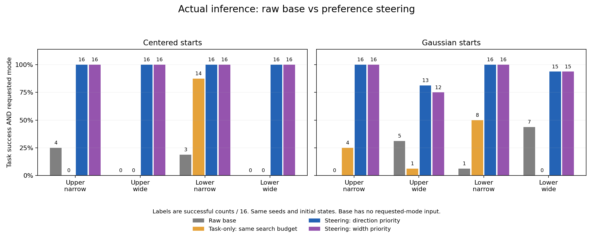
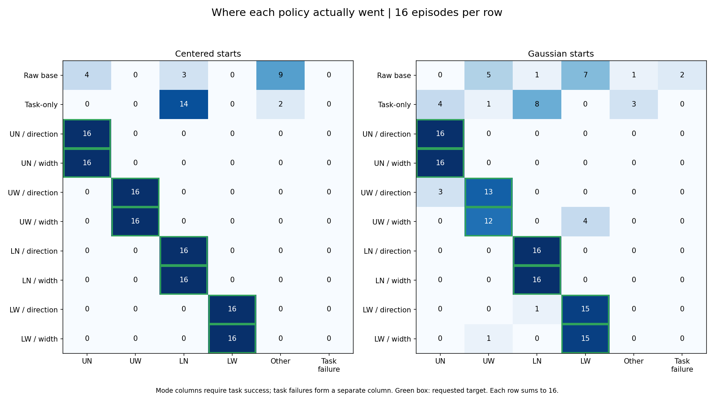
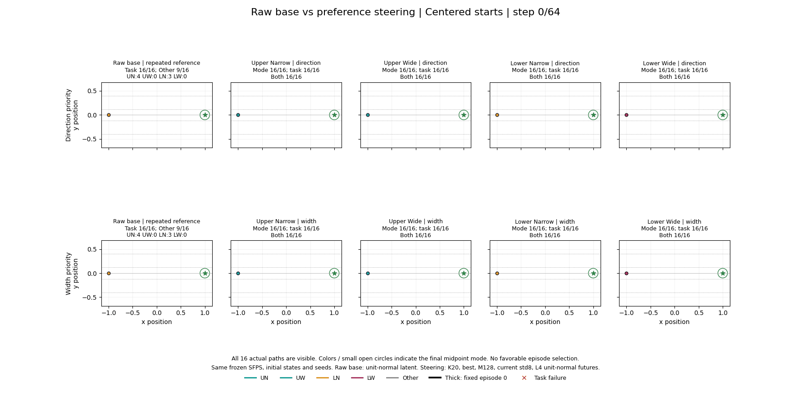
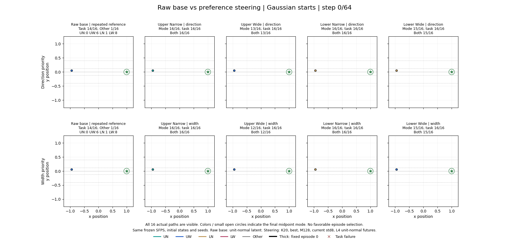

# Raw base와 preference steering의 mode 선택 비교

2026-09-12. [Method](2026-09-12-preference-steering-method.md), [기존 mode 실험](2026-09-12-mode-aligned-steering-results.md).

**Goal 도달과 mode 선택을 분리하면 steering의 효과가 보인다.** Centered base는 goal에 모두 도달하지만 wide가 없고 중앙 Other가 많다. Steering은 동일한 base checkpoint를 사용해 요청한 네 mode를 모두 선택했다. Gaussian wide에는 아직 일부 mode 불일치가 남는다.

## 비교 대상과 성공 정의

- Raw base: preference 입력 없이 매 결정 unit-normal latent 하나를 실행. 목표 mode에 따라 달라지는 policy가 아니므로, 같은 16개 base 경로의 mode 발생 빈도를 각 목표와 비교한다.
- Steering: 합성 scoped 응답 20개로 학습한 preference, mode feature, best, M128, 현재 latent std8, L4/unit-normal 미래. 그룹 우선순위 두 설정 모두 표시한다.
- Task-only: steering과 동일한 M128/std8/L4/best에서 preference 항만 제거. Raw base 대비 변화에는 탐색 폭·후보 수·task cost도 포함되므로, preference의 역할을 확인할 때 이 대조군을 함께 본다.
- **Task success**: 65개 state 완주, numerical/action-limit failure 없음, 최종 goal tolerance .1 충족.
- **Mode hit**: 실제 step32 위치가 요청한 midpoint bin에 속함. Goal 실패 여부와 별개다.
- **Joint success**: task success AND mode hit. 아래 주 비교표의 성공 기준이며 분모는 항상 전체16개 episode다.
- Other는 midpoint가 (-.12,.12)에 있는 중앙 경로이며 task failure와 다르다.

동일한 초기 위치·환경 seed·rollout seed와 frozen checkpoint/stats를 확인했다. 기존 공개 compact NPZ에서 base32 + task-only32 + learned256 = 320 episode를 재집계했고, 새 학습/추론은 실행하지 않았다. 비교에 쓴 36개 source condition의 저장 지표도 독립 bin 계산과 대조했다. Profile별 반복은 독립 표본 수를 늘리지 않는다.

이전 전후 GIF의 회색 before는 초기 continuous **steering**이었다. 이 문서의 첫 열은 preference가 없는 **raw base**로 교체한 직접 비교다.

## Base 자체의 실제 mode 분포

각 mode 셀은 **mode 발생 수 (그중 goal까지 성공한 수)**다.

| 시작점 | UN | UW | LN | LW | Other | Task success |
|---|---:|---:|---:|---:|---:|---:|
| Centered | 4 (4) | 0 (0) | 3 (3) | 0 (0) | 9 (9) | 16/16 |
| Gaussian | 0 (0) | 6 (5) | 1 (1) | 8 (7) | 1 (1) | 14/16 |

Gaussian base의 episode4와5는 각각 LW/UW 경로로 완주했지만 goal을 놓쳤다. 따라서 mode만 세면 LW8/UW6이며, joint success는 LW7/UW5다.

## 요청 mode별 joint success

| 시작점 | 목표 mode | Raw base | Task-only, 동일 탐색량 | Steering 방향 우선 | Steering 폭 우선 |
|---|---|---:|---:|---:|---:|
| Centered | upper_narrow | 4/16 | 0/16 | 16/16 | 16/16 |
| Centered | upper_wide | 0/16 | 0/16 | 16/16 | 16/16 |
| Centered | lower_narrow | 3/16 | 14/16 | 16/16 | 16/16 |
| Centered | lower_wide | 0/16 | 0/16 | 16/16 | 16/16 |
| Gaussian | upper_narrow | 0/16 | 4/16 | 16/16 | 16/16 |
| Gaussian | upper_wide | 5/16 | 1/16 | 13/16 | 12/16 |
| Gaussian | lower_narrow | 1/16 | 8/16 | 16/16 | 16/16 |
| Gaussian | lower_wide | 7/16 | 0/16 | 15/16 | 15/16 |

Steering과 task-only는 모든 조건에서 task 자체가16/16 성공했다. 주 표의 steering 실패는 mode 불일치다. Raw base에서 이미 요청 mode+task에 성공한 episode를 steering이 실패로 바꾼 경우는 이번 비교에서0건이었다. CSV/JSON의 rescued/retained/lost가 같은 episode별 전이를 기록한다.

## Steering이 실제로 선택한 mode 전체 분포

각 행은 같은16개 seed다. Mode 열에는 task까지 성공한 episode만 넣고 task 실패를 마지막 열로 분리하여 각 행의 합이16이 되게 했다. 초록 테두리는 요청 mode다.

Gaussian upper-wide 실패는 방향 우선에서 UN3개, 폭 우선에서 LW4개였다. Lower-wide 실패는 방향 우선에서 LN1개, 폭 우선에서 UW1개였다. 우선순위가 서로 다른 속성의 포기를 유도하는 모습도 이 분포에서 확인할 수 있다.

## 실제 추론 GIF

각 행의 첫 열은 같은 raw base reference, 나머지 네 열은 요청 mode다. 위/아래 행은 방향/폭 우선이다. 전체16개 경로를 표시하고 굵은 경로는 모든 패널에서 고정 episode0이다. 색은 최종 midpoint mode, 원형 표식은 step32 위치, 빨간 x는 task 실패다. 가상 미래나 성공 사례만 골라 만든 경로가 아니다.

## 판정과 한계

이번 seed 집합에서 **Centered 네 mode와 Gaussian narrow의 preference steering은 성공**했다. Gaussian wide는 raw base보다 joint success가 늘었지만 아직 안정적인 전환을 모두 달성하지 못했다. 특히 centered에서는 base goal16/16이라는 값만으로 mode 제어가 성공했다고 판단하면 안 된다.

Raw base 비교는 전체 inference wrapper의 효과이며 preference 하나만의 인과 효과로 해석하지 않는다. 동일 탐색량 task-only 대조군도 네 요청 mode를 따로 선택하지 못하므로, 현재 설정에서 preference 항이 목표별 분포를 바꾸는 역할을 확인할 수 있다. 다만16개 기존 pilot seed, hard-bin mode, 합성 피드백의 결과다. 16/16의 Wilson95% 하한은 약80.6%이며 새로운 seed/사용자에 대한 보장은 아니다.

## 산출물과 재현

- [JSON: 모든 mode·task mask와 paired 전이](artifacts/2026-09-12-base-vs-steering/comparison.json)
- [CSV: 목표별 비교](artifacts/2026-09-12-base-vs-steering/target_mode_comparison.csv)
- [재현 스크립트](compare_base_steering.py): `MPLCONFIGDIR=/tmp/base-mode-mpl .venv/bin/python docs/research/compare_base_steering.py`.
- 원본: `docs/research/artifacts/2026-09-12-preference-steering/actual_rollouts.npz`. 새 checkout에서도 이미 Git에 포함된 이 파일로 재집계한다.
- Checkpoint와 source NPZ hash, 초기 상태/seed pairing 검증은 JSON `provenance`에 있다.
