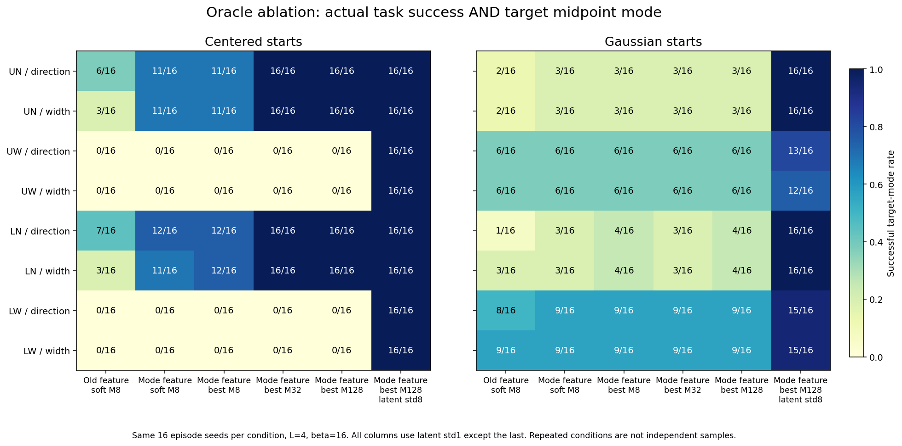
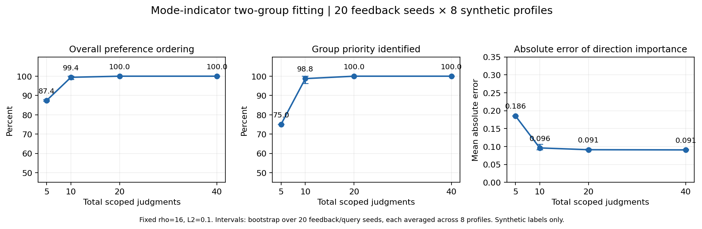
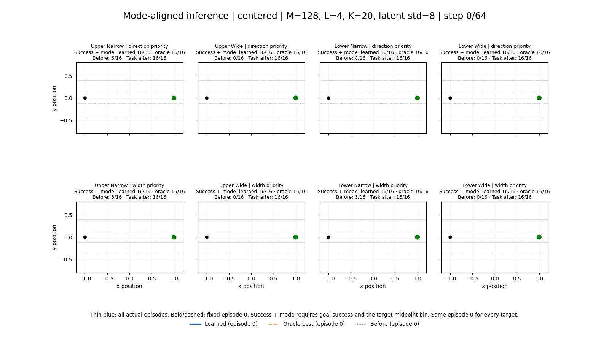
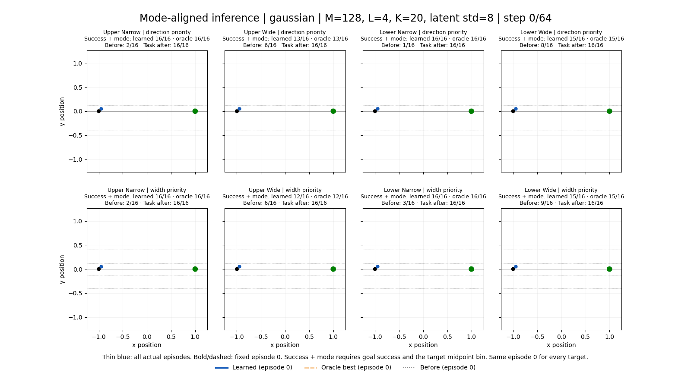

# 두 그룹 mode 선택 교정: 실제 추론 결과

2026-09-12. [이전 진단](2026-09-12-mode-selection-diagnosis.md)에 따라 feature 의미, 선택 방법, 후보 수, latent 탐색 폭을 분리해서 검사했다.

**Centered 시작점에서는 네 mode 모두 선택됐다.** Mode feature, argmax, M=128, 현재 latent 표준편차 8에서 oracle과 learned20 모두 각 profile별 16/16 episode가 목표 mode와 goal 도달을 함께 충족했다. **Gaussian 시작점에서는 narrow가 모두 성공했고, wide에는 일부 실패가 남았다.** Policy 재학습 없이 가능한 개선과 남은 한계를 구분한 결과다.

## 변경한 제어와 feature

기존 continuous feature는 upper 점수가 높이와 함께 증가하고 narrow 점수가 직선을 가장 높게 평가했다. 새 `feature_kind=mode`는 현재 평가 기준과 같은 midpoint bin을 사용한다.

| Mode | `y_32` 범위 | Direction feature (upper, lower) | Width feature (wide, narrow) |
|---|---|---|---|
| Upper-narrow | `[.12,.4)` | (1,0) | (0,1) |
| Upper-wide | `[.4,+∞)` | (1,0) | (1,0) |
| Lower-narrow | `(-.4,-.12]` | (0,1) | (0,1) |
| Lower-wide | `(-∞,-.4]` | (0,1) | (1,0) |
| Other | `(-.12,.12)` | (0,0) | (0,0) |

비교는 저장된 값을 float64로 변환한 뒤 한다. 중도 실패 경로의 feature도 0이다. Goal을 놓쳤더라도 완주한 경로는 geometric feature를 계산하고 별도 task cost를 받는다. 그룹 내부 weight와 그룹 간 alpha simplex, scoped BT fitting은 유지했다. P/M/C 확장은 없다.

새 feature에서는 네 대표 경로와 직선을 평가할 때 여덟 합성 profile 모두 자신의 목표 mode를 가장 높게 평가한다. 두 속성을 모두 만족하는 경로가 있으면 방향/폭 중요도가 달라도 같은 경로를 선택할 수 있다. Alpha는 한 속성씩 상충하는 후보 사이에서 역할을 한다. Other를 제외한 현재 query bank에서는 두 그룹 feature가 각각 complementary하므로, overall-only feedback의 분리 식별 문제를 해결했다고 주장하지 않는다. Direction/width/overall scoped feedback을 계속 사용한다.

새 실행 옵션은 `--feature-kind mode`, `--selection-method best`, `--proposal-std 8`이다. 호환성 기본값은 기존 continuous/soft/std1이다. `best`는 유효한 후보 중 score argmax를 고르고, 모두 invalid이면 실제 현재 위치를 유지하는 8-command fallback을 기록한다.

현재 후보와 이후 가상 미래는 다음과 같다.

\[
z_j=\sigma\epsilon_j,\quad \epsilon_j\sim\mathcal N(0,I),\qquad
z^{\rm future}_{j\ell}\sim\mathcal N(0,I).
\]
\[
S_j=16\frac1L\sum_\ell U_\theta(\tau_{\rm observed}\oplus
\tau_{\rm current}(z_j)\oplus\tau^{j\ell}_{\rm base})
-\frac1L\sum_\ell[(\mathrm{goalError}_{j\ell}/.1)^2+25\mathbf1\{failure\}].
\]

Soft 조건은 `exp(S_j)`로 유효 후보를 재가중하고 best 조건은 argmax를 쓴다. **Std8은 현재 guided proposal 분포를 바꾼 설정**이다. 원래 unit-normal prior에 대한 importance correction을 적용한 방법이나 동일 prior의 정확한 Gibbs sampling이 아니다. 미래의 L=4 continuation과 raw base 조건은 unit normal을 유지한다. 체크포인트와 normalization 통계는 동결했다.

Anchor는 모든 현재 후보에 공통인 실제 prefix 끝에서 정해진다. 기존 SFPS의 normalized observation anchor를 사용하며, 9개 반환점 중 처음 anchor를 버리고 8개 command만 실행한다. 이전에 확인한 observation/action normalization 차이도 유지·기록한다. 사용자나 목표 mode에 따라 anchor를 이동시키지 않는다.

## 실제 learned20 결과

각 셀은 **task success AND target midpoint mode**를 함께 만족한 횟수다. 분모는 조건마다 같은 16개 환경/latent seed다. Before는 이전 continuous/soft/M8/std1 learned20이며, After는 mode/best/M128/std8이다. Feature 의미가 달라졌으므로 before/after의 raw utility 값은 비교하지 않는다. 새 mode feature로 query/heldout BT 응답을 다시 생성했다.

| Profile | Centered before | Centered learned20 | Centered oracle | Gaussian before | Gaussian learned20 | Gaussian oracle |
|---|---:|---:|---:|---:|---:|---:|
| upper_narrow_direction | 6/16 | 16/16 | 16/16 | 2/16 | 16/16 | 16/16 |
| upper_narrow_width | 3/16 | 16/16 | 16/16 | 2/16 | 16/16 | 16/16 |
| upper_wide_direction | 0/16 | 16/16 | 16/16 | 6/16 | 13/16 | 13/16 |
| upper_wide_width | 0/16 | 16/16 | 16/16 | 6/16 | 12/16 | 12/16 |
| lower_narrow_direction | 8/16 | 16/16 | 16/16 | 1/16 | 16/16 | 16/16 |
| lower_narrow_width | 3/16 | 16/16 | 16/16 | 3/16 | 16/16 | 16/16 |
| lower_wide_direction | 0/16 | 16/16 | 16/16 | 8/16 | 15/16 | 15/16 |
| lower_wide_width | 0/16 | 16/16 | 16/16 | 9/16 | 15/16 | 15/16 |

주 비교의 모든 guided 조건은 task 자체가 16/16 성공했고 fallback은 0이었다. 표의 실패는 목표 mode 불일치다. 각 조건의 16 episode 및 동일 episode를 재사용하는 profile/방법을 독립 성공률 표본으로 합산하지 않는다. 16/16도 일반적인 100% 성공 보장은 아니며, 예를 들어 Wilson 95% 구간의 하한은 약 80.6%다. 이 초기 상태/seed들로 탐색 폭을 진단했으므로 주 결과는 탐색적 pilot이다.

## 한 변수씩 바꾼 oracle 비교



- **Feature만 교정:** Centered upper-narrow의 oracle mode 성공이 방향 우선 6→11/16, 폭 우선 3→11/16으로 늘었다. Wide는 여전히 0이다.
- **M8에서 argmax로 변경:** Centered upper-narrow 11/16, lower-narrow 12/16으로 후보 bank의 한계가 남았다.
- **Std1에서 M32/M128:** Best의 Centered narrow는 네 profile 모두 16/16이 됐지만 wide는 모두 0/16이었다. Gaussian의 branch 문제도 대부분 남았다. Soft는 후보가 있어도 계속 확률적으로 선택하므로 best와 결과가 다를 수 있다.
- **M128/best에서 std8로 변경:** Centered의 모든 mode, Gaussian의 모든 narrow가 16/16이 됐다. 이 단계가 wide 후보 부족을 크게 줄였다.

전체 soft/best 조건의 원자료와 집계는 [조건 CSV](../../env/artifacts/grouped_preference/analysis/mode-comparison/conditions.csv), [조건 JSON](../../env/artifacts/grouped_preference/analysis/mode-comparison/conditions.json)에 있다. 그림은 핵심 oracle 경로를 표시하며, CSV에는 M32/M128 soft 결과도 포함된다.

## 초기 후보 coverage와 추가 탐색

첫 결정에서 현재 후보 M개와 L=4 base 미래를 생성했다. 아래 숫자는 **성공하는 해당 mode 미래가 하나라도 있는 episode bank 수 / 16**이며, 실제 closed-loop 제어 성공률이 아니다. Centered의 16 bank는 같은 상태에서 다른 latent seed를 사용한다.

| 현재 proposal | Centered UN/UW/LN/LW | Gaussian UN/UW/LN/LW | Gaussian valid current |
|---|---|---|---:|
| std1, M128 | 16 / 0 / 16 / 0 | 3 / 6 / 4 / 9 | 2048/2048 |
| std4, M128 | 16 / 13 / 16 / 16 | 15 / 8 / 15 / 14 | 2024/2048 |
| std8, M128 | 16 / 16 / 16 / 16 | 16 / 13 / 16 / 15 | 1468/2048 |
| std8, M512 | 16 / 16 / 16 / 16 | 16 / 15 / 16 / 16 | 5766/8192 |
| std16, M512 | 16 / 16 / 16 / 16 | 16 / 15 / 16 / 16 | 2287/8192 |

Std16은 이 검사에서 남은 Gaussian upper-wide bank를 해결하지 못했고 유효 후보를 크게 줄였다. Std8/M128 주 closed-loop 실험에서도 전체 guided decision의 평균 유효 후보 비율은 약 **61.8%**였다. 유효성 필터가 실제 실행에 중요하다.

추가 M512 검사에서도 Gaussian episode 6, 시작점 `(-.92977947,-.04725749)`의 유효 후보에는 upper-wide가 없었다. 최대 예측 midpoint y는 std8에서 .38335, std16에서 .38909였다. 이는 유한 bank에 대한 관찰이며, 동결 policy의 모든 latent sequence에서 upper-wide가 불가능하다는 증명은 아니다.

## 미래 chunk까지 탐색한 실패 사례 검사

현재 한 chunk의 score는 이후를 **base policy로 계속 실행한다는 가정**으로 계산한다. 목표 mode가 경계를 넘기 전에는 hard-bin 점수가 동일하고, 다음 chunk에도 guidance를 적용해 도달할 수 있는 mode를 이 score가 충분히 반영하지 못할 수 있다.

이를 보기 위해 주 oracle 실험의 Gaussian wide 실패 9개 profile/episode 사례만 추가 검사했다. 저장된 첫 M128 후보에서 마지막 y 위치에 따라 균등하게 퍼진 유효 후보 최대 8개를 골랐다. 각 prefix에서 실제 다음 replan과 같은 M128/std8 current draws와 L4/unit-normal 미래를 평가하고, 두 chunk를 함께 oracle score로 선택했다. 이후에는 **미리 정한 future sample 0**을 실행했다. 실현된 미래 중 잘 된 것을 골라 성공으로 세지 않았다.

이 방법은 실패 사례 **3/9**를 task+mode 성공으로 바꿨다. Upper-wide의 episode 6 두 우선순위와 width-priority episode 12가 해당한다. 새 command 전체를 실제 Gym에서 실행하고 저장된 예측 위치와 일치함을 확인했다. 따라서 적어도 일부 실패는 첫 bank의 부족이 곧 전역 불가능성을 뜻하지 않는다는 증거다. 동시에 제한된 두-chunk 탐색도 나머지 실패를 해결하지 못했다.

이 검사는 실패 조건에 집중한 oracle 진단이며, 전체 조건의 성공률이나 learned20 제어 개선 결과로 해석하면 안 된다. 주 GIF/표에는 이 추가 경로를 끼워 넣지 않았다. [진단 원자료](../../env/artifacts/grouped_preference/mode-aligned-two-chunk-probe/diagnostics.json), [재현 스크립트](../../env/artifacts/grouped_preference/analysis/two_chunk_probe.py).

다음 제어 단계에서는 guidance를 적용한 미래의 값을 반영하는 lookahead와 더 충분한 latent-sequence 탐색을 평가하는 것이 타당하다. Hard-bin feature는 이번 mode 일치 검증의 기준이며, 시연 폭의 중심이나 경로의 매끄러움을 선호하는 연속 점수까지 검증한 것은 아니다. 주 그림의 일부 wide 경로가 .4 경계 근처에 모이는 것도 이 목적 정의와 맞는다. Gaussian 초기 context를 포함하는 base 학습 보완은 별도의 비교가 필요하다.

## Few-shot fitting

새 feature로 독립 query/응답 seed 20개 × 합성 profile 8개 × K5/10/20/40, 총 640 fit을 실행했다. 모두 optimizer/projected-gradient 수렴 기준을 충족했다. 각 K의 표본 수는 160 fit이다.

| Scoped 응답 K | 그룹 중요도 방향 일치 | 전체 선호 순서 일치 | alpha_D MAE | 두 그룹 내부 선호 모두 일치 |
|---|---:|---:|---:|---:|
| 5 | 75.0% | 87.4% | .186 | 100% |
| 10 | 98.8% | 99.4% | .096 | 100% |
| 20 | 100% | 100% | .091 | 100% |
| 40 | 100% | 100% | .091 | 100% |



합성 rho=16 응답에서는 명확한 그룹 선호 응답이 거의 결정적이다. Hard-bin toy의 쉬운 순서 복원 결과를 실제 인간 선호 학습 성능으로 확대하지 않는다. K20의 그룹 내부 weight MAE는 약 .148로, 정답 .9/.1 값을 정확히 복원한 것도 아니다. 실제 주 실행의 32 fit도 모두 수렴했으며 learned20과 oracle의 **목표 mode 성공 횟수**가 각 조건에서 같았다. 이는 trajectory나 파라미터 전체가 같다는 주장은 아니다.

## 실제 inference GIF

얇은 파랑은 이후의 실제 16개 episode 전체, 굵은 파랑은 learned20 episode 0, 주황은 oracle-best episode 0, 회색은 이전 learned20의 같은 episode 0이다. 행은 direction/width 중요도, 열은 UN/UW/LN/LW다. 실패한 episode도 그대로 표시했다. 특히 Gaussian lower-wide의 고정 episode 0은 목표 mode를 놓치는 모습이 남아 있다.





## 검증과 재현

새 정규 비교는 5개 실행 폴더, **172조건 × 16 = 2,752 실제 episode**다. 이 전체의 requested commands를 새 Gym에서 재실행하고 **22,016개 decision**의 feature 평균, task cost, score, soft RNG/argmax, current RNG와 proposal scaling, 관측 anchor와 공유 prefix를 독립적으로 검사했다. 모두 일치했다. 추가 실패 진단의 9개 실행은 이 수에 포함하지 않았다. Checkpoint/loaded policy/stats 동결 검사도 통과했다.

전체 `env/tests`: **389 passed, 2 skipped, 15 warnings**, root 실행 109.88초. Skip은 CPU sandbox의 CUDA 사용 불가와 기존 canonical Stage B1 artifact 부재다. 경고는 기존 NumPy/Gym deprecation 및 NVML 환경 경고다. 별도로 실제 GPU 추론을 수행했다. 코드의 두 단계 spec/quality 검토와 [최종 독립 검토](artifacts/2026-09-12-preference-steering/reviews/2026-09-12-mode-aligned-steering-final-review.md) 모두 PASS였다. 최종 검토에서는 172개 조건 전체의 선택 candidate와 실행 command 연결, current 및 future 난수 재현, paired seed와 artifact hash를 추가 확인했다. 실패 진단 9개 경로도 별도로 Gym에서 재실행해 3/9 결과를 확인했다. Source manifest의 간접 의존 파일 누락은 아래처럼 범위를 명시한 비차단 개선사항으로 기록했다.

주 M128/std8 실행은 RTX A5000에서 약 **529.4초**였다. Guided 16-episode batch replan p50은 조건별 약 **1.62–1.71초**다. CPU 후보 검증, future simulation, Gym 실행 등을 포함한 batch 수치이며 단일 로봇의 실시간 latency 검증이 아니다.

주 실험 재현(B2 worktree에서 새 출력 폴더 사용):

```bash
PYTHONPATH=. MPLCONFIGDIR=/tmp/mode-mpl .venv/bin/python -m env.run_grouped_preference \
  --checkpoint-path env/artifacts/stage_b/b2-seed0-optimized/sfps_best.pt \
  --stats-path env/artifacts/stage_b/b2-seed0-optimized/pusht_stats.npz \
  --demonstrations-path ../../env/artifacts/demonstrations.npz \
  --output-dir env/artifacts/grouped_preference/mode-aligned-best-M128-std8-rerun \
  --device cuda:0 --feature-kind mode --selection-method best \
  --proposal-std 8 --candidates 128 --continuations 4 --rollout-count 16 --seed 0
```

Oracle matrix는 `python -m env.run_mode_ablation`에서 같은 checkpoint/stats/data 인자와 `--candidates 8 32 128 --methods soft best --feature-kind mode --proposal-std 1`을 사용한다. 이 runner는 조건별 원자적 artifact/완료 marker를 저장하고 manifest에 명시한 source 8개·config·checkpoint·stats·data 및 artifact hash가 일치할 때만 재개한다. Source 검사는 모든 간접 의존 파일을 포함하지 않는다. 따라서 normalization/loader/seed helper를 포함해 어떤 code라도 변경했다면 새 폴더를 사용해야 한다. 이번 실행 중 해당 의존 코드 변경은 없었다.

종료 시점의 [검증 manifest](../../env/artifacts/grouped_preference/analysis/mode-comparison/final_verification.json)와 [source snapshot](../../env/artifacts/grouped_preference/analysis/mode-comparison/final-verified-sources.zip)도 저장했다. 이는 종료 시점의 파일을 보존한 것이며, 모든 실행의 시작 시점에 모든 source hash를 수집했다는 의미는 아니다.

결과 폴더:

- `mode-aligned-soft-M8-std1`, `mode-aligned-best-M8-std1`: 새 feature의 soft/best, oracle/learned20 비교.
- `mode-aligned-ablation-M32-std1`, `mode-aligned-ablation-M128-std1`: 각 32조건 oracle matrix.
- `mode-aligned-best-M128-std8`: 주 oracle/learned20 결과와 GIF.
- `mode-aligned-coverage-*`: 첫 결정의 counterfactual coverage 검사.
- `mode-aligned-two-chunk-probe`: 실패 사례에 한정한 추가 미래 탐색.

Checkpoint SHA-256: `4228d9dae9baedc8b64d66ffb4d768798731f2c6788efea681dc18d745e2abba`.
Train-data digest: `3fb4d5e8f79027bf1c113c8a85d48b82e30e43e707b8c895be96b9ab49d82e78`.
기존 B2 worktree의 변경과 모든 이전 실험을 보존했다. 실험 완료 후의 문서·코드 publication과 Git에 포함한 산출물 범위는 [artifact 목록](2026-09-12-preference-steering-artifacts.md)에 기록한다.
